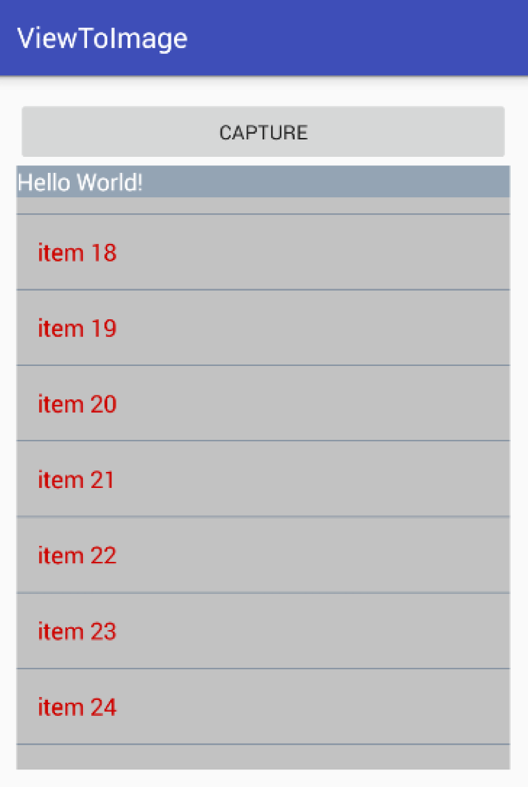
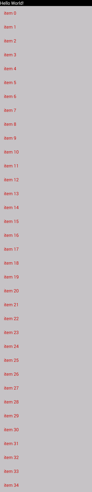
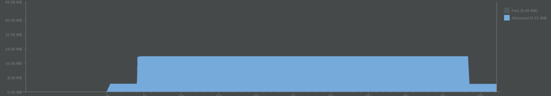

# ViewToImage

## Introduce
本demo目标想做成网易云音乐歌词分享，动态生成文字+图片。

## Feature
* 根据View生成Bitmap，保存图片
* 支持ListView生成**超过一屏的长图**

## 截图

[应用主界面](art/main.png)

[保存的长截图](art/20160120_035750s.jpg)

 
## 内存截图
在720x1280 320dp模拟器上测试内存占用图

初始状态应用占用4M, 截图后应用占用20M, 3.5个屏幕大小截图大约16M，并不会导致OOM，并且截图后内存及时回收~，不会导致内存问题

## 体验包
[体验包](art/app-debug.apk)

## Blog
todo

## Android机上图片down到本地
adb pull /sdcard/123/20160120_035750.jpg art

## Ref

[android Bitmap（将视图转为bitmap对象）](http://www.cnblogs.com/crazywenza/p/3239799.html)
[Android学习笔记进阶18之画图并保存图片到本地](http://blog.csdn.net/sjf0115/article/details/7269117)
[http://stackoverflow.com/questions/12742343/android-get-screenshot-of-all-listview-items](http://stackoverflow.com/questions/12742343/android-get-screenshot-of-all-listview-items)
[Android中View转换为Bitmap及getDrawingCache=null的解决方法](http://www.cnblogs.com/devinzhang/archive/2012/06/05/2536848.html)

